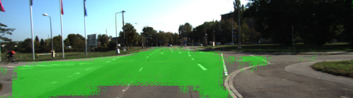
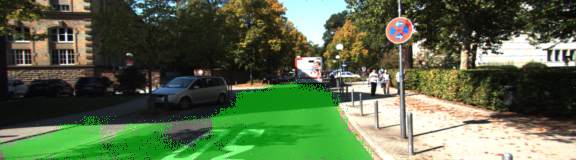

# Semantic Segmentation
## Introduction
The objective of the project is label the pixels of a road in images using a Fully Convolutional Network (FCN).

## Design

The network is based on VGG net which is conventionally used for image classification tasks. From the output of vgg-16, a few transposed convolution layers are added to up-scale the output size to the original image size. Skip layers are also added to propagate spacial information from input to output. The resulting network is able to be trained for semantic segmentation tasks. The design is from [this pager](https://people.eecs.berkeley.edu/~jonlong/long_shelhamer_fcn.pdf) by Long et al. The network architecture is illustrated below: (Image Credit: http://cvlab.postech.ac.kr/research/deconvnet/)

The loss is defined as cross entropy loss on all pixels in a image. L2 regularization is also added on all the weights of the deconvolution network.

## Training

The network is trained for 4 epochs on ~300 images. The following graph shows the training loss reducing over each batch of the images.

## Result

Here are a few examples of the training result.

The network is able to label road mand non-road pixels correctly most of the time.

It lables current lane correctly but is challenged for the opposite lane. It is able to avoid grass and side walk pixels.

The network also performs well druing high contrast situations.

